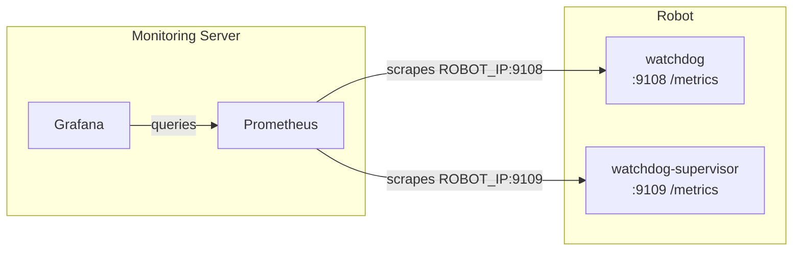

# Watchdog

`watchdog` is a local-first health watchdog for robots and other sensor-dense edge devices.

It is meant to run on the robot, not in the cloud. It polls local health sources, writes incident snapshots, and sends structured action requests to a local supervisor. Remote dashboards and fleet systems can be added later, but they are not part of the safety-critical path.

## What Ships Today

Current binaries:

- `watchdog`: polling daemon
- `watchdog-supervisor`: local action receiver and latch
- `watchdogctl`: operator status tool

Current built-in source families:

- `host`: CPU temperature, memory, load, hottest sensor
- `module_reports`: JSON heartbeats from local modules, including C++ producers
- `systemd`: service state, main PID, restart count
- `network`: Linux link state and interface counters
- `power`: Linux `power_supply` state
- `storage`: free space, read-only state, busy percentage
- `time_sync`: `timedatectl` state, RTC drift, sync grace window
- `can`: SocketCAN and command-based probes
- `ethercat`: SOEM, partial IgH, and command-based probes

Current local action policy:

- `warn` -> `notify`
- `fail` or `stale` -> `degrade`
- drive hardware `fail` from node-exported current/temp/fault diagnostics -> `safe_stop`
- EtherCAT required link down or critical slave fault -> `safe_stop`
- aggregate EtherCAT lost slave without topology -> `safe_stop`
- recovery -> `resolve`

Prometheus-compatible `/metrics` endpoints are now built into both `watchdog` and `watchdog-supervisor`, so the same surface can feed Prometheus, Grafana, or Datadog OpenMetrics collection.

## Install From Release

The published Linux target today is Ubuntu 24.04 x86_64.

Download the latest release asset:

- `watchdog-v<version>-ubuntu24-amd64.tar.gz`
- `watchdog-v<version>-ubuntu24-amd64.tar.gz.sha256`

Install it on the robot:

```bash
tar -xzf watchdog-v<version>-ubuntu24-amd64.tar.gz
cd watchdog-v<version>-ubuntu24-amd64

sudo install -d /etc/watchdog
sudo install -m 0755 bin/watchdog /usr/local/bin/watchdog
sudo install -m 0755 bin/watchdog-supervisor /usr/local/bin/watchdog-supervisor
sudo install -m 0755 bin/watchdogctl /usr/local/bin/watchdogctl
sudo install -m 0644 configs/watchdog.json /etc/watchdog/watchdog.json
sudo install -m 0644 configs/watchdog-supervisor.json /etc/watchdog/watchdog-supervisor.json
sudo install -m 0644 systemd/watchdog.service /etc/systemd/system/watchdog.service
sudo install -m 0644 systemd/watchdog-supervisor.service /etc/systemd/system/watchdog-supervisor.service
sudo systemctl daemon-reload
sudo systemctl enable --now watchdog-supervisor watchdog
```

The robot does not need the Go toolchain installed.

## Build From Source

```bash
go build ./...
```

Build release-style binaries locally:

```bash
mkdir -p dist/linux-amd64
go build -o dist/linux-amd64/watchdog ./cmd/watchdog
go build -o dist/linux-amd64/watchdog-supervisor ./cmd/watchdog-supervisor
go build -o dist/linux-amd64/watchdogctl ./cmd/watchdogctl
```

## First Config To Use

For a real Ubuntu 24.04 x86_64 node, start from:

- `configs/watchdog.ubuntu24-amd64.json`
- `configs/watchdog-supervisor.ubuntu24-amd64.json`

That baseline is intentionally conservative:

- enabled by default: `host`, `storage`, `time_sync`, module ingest, supervisor actions
- disabled until you fill real platform values: `systemd`, `network`, `power`, `can`, `ethercat`

For a fuller robot bring-up, use:

- `configs/watchdog.robot-baseline.example.json`

Edit these first:

- `systemd.units`
- `network.interfaces`
- `power.supplies`
- `can.interfaces`
- module report source IDs for robot main and drive diagnostics
- drive metric thresholds under `rules.module`
- optional `ethercat.masters` for platforms where watchdog probes fieldbus state directly
- optional `ethercat.masters[].slaves[]` with `criticality: critical|important|optional`
- `sources.time_sync.require_synchronized`
- `sources.time_sync.sync_grace_period`

## Runtime Layout

Config:

- `/etc/watchdog/watchdog.json`
- `/etc/watchdog/watchdog-supervisor.json`

Runtime sockets:

- `/run/watchdog/module.sock`
- `/run/watchdog/supervisor.sock`

Persistent state and incidents:

- `/var/lib/watchdog/incidents/`
- `/var/lib/watchdog/actions/`
- `/var/lib/watchdog/logs/manifests/`
- `/var/lib/watchdog/logs/incident-index/`
- `/var/lib/watchdog/supervisor/current_state.json`
- `/var/lib/watchdog/supervisor/latest.json`
- `/var/lib/watchdog/supervisor/requests/`

### Retention & Durability

Forensic writes are power-loss durable. Incident snapshots, supervisor audit
records, and shadow-FSM request records are written with an `fsync` of both the
file and its parent directory, so completed evidence survives a power cut - the
canonical robot incident. The high-churn mirrors (`latest.json`,
`current_state.json`, shadow `latest.json`) use crash-safe atomic renames
without fsync, since they are always reconstructable.

Persistent directories are bounded so watchdog never fills the device it is
meant to protect. A background sweeper (default every `60s`) prunes the audit,
incident, and shadow-request dirs to a byte budget and file-count cap, always
retaining the newest `min_keep` files regardless. Pruning runs off the
health/action path and never blocks it.

Idle module report sources are evicted from memory and from `/metrics` after
`report_ttl` (default `15m`) with no new heartbeat, so churned `source_id`s do
not grow memory or metric cardinality without bound.

Set `dedup_cache_size` on the supervisor to bound the in-memory recent-request
window used for duplicate suppression; keep it at or below `retention.audit.max_files`
so a restart reseed covers the full window. Retention and TTL are optional and
backward compatible: any `max_files`/`max_bytes` of `0`, or `report_ttl` of `0`,
disables that limit and reproduces the previous unbounded behavior.

**Upgrade note:** after upgrading, a deployment with no `retention` block does
*not* stay unbounded - it enforces the bounded defaults on first restart.
Incident, audit, and shadow-request files beyond the budget are pruned
oldest-first, and idle module report sources are evicted after `report_ttl`
(default `15m`). To keep the old unbounded behavior, set `max_files: 0` and
`max_bytes: 0` (and `report_ttl: 0`) explicitly.

Example supervisor config:

```json
"dedup_cache_size": 2048,
"retention": {
  "sweep_interval": "60s",
  "audit":  { "max_files": 5000, "max_bytes": "64Mi", "min_keep": 100 },
  "shadow": { "max_files": 1000, "max_bytes": "32Mi", "min_keep": 50 }
}
```

Example watchdog config:

```json
"retention": {
  "sweep_interval": "60s",
  "incidents": { "max_files": 1000, "max_bytes": "64Mi", "min_keep": 50 }
},
"sources": { "module_reports": { "report_ttl": "15m" } }
```

Service logs:

- `journalctl -u watchdog`
- `journalctl -u watchdog-supervisor`

Metrics endpoints:

- `watchdog`: `127.0.0.1:9108/metrics`
- `watchdog-supervisor`: `127.0.0.1:9109/metrics`

If Grafana is running on a different machine, these loopback binds are not reachable from it. In that case, use the `remote-metrics` example configs and scrape the robot's real IP or hostname instead.

## How To Inspect It

Live logs:

```bash
sudo journalctl -u watchdog -f
sudo journalctl -u watchdog-supervisor -f
```

Operator view:

```bash
watchdogctl status -config /etc/watchdog/watchdog-supervisor.json
watchdogctl status -config /etc/watchdog/watchdog-supervisor.json -verbose
watchdogctl status -config /etc/watchdog/watchdog-supervisor.json -json -verbose
```

Important files:

```bash
sudo jq . /var/lib/watchdog/supervisor/current_state.json
sudo jq . /var/lib/watchdog/supervisor/latest.json
sudo ls -lt /var/lib/watchdog/incidents
sudo ls -lt /var/lib/watchdog/logs/incident-index
```

Raw log linking is optional and disabled by default. When enabled, watchdog does
not write high-rate raw data itself; it scans raw segment manifests and writes a
sidecar index for incident review.

```json
"raw_logs": {
  "enabled": true,
  "manifest_dir": "/var/lib/watchdog/logs/manifests",
  "incident_index_dir": "/var/lib/watchdog/logs/incident-index",
  "pre_window": "30s",
  "post_window": "30s"
}
```

`watchdog-log-agent` is the local segment producer used by the simulation and by
early robot bring-up. It writes JSONL raw segments plus manifest v1 files, then
reports its own health through the existing module report socket:

```bash
watchdog-log-agent \
  -module-socket /run/watchdog/module.sock \
  -segment-dir /var/lib/watchdog/logs/segments \
  -manifest-dir /var/lib/watchdog/logs/manifests \
  -source-id imu.front \
  -data-type imu \
  -segment-duration 5s \
  -sample-interval 100ms
```

If the module socket is absent, segment writing continues and health reporting is
skipped for that attempt. Watchdog remains optional for the producer path.
For robot processes that should write segments directly, the C++ SDK provides
`watchdog::rawlog::SegmentWriter` with the same manifest v1 contract.

## Prometheus and Grafana

Both processes can expose Prometheus-compatible metrics:

```json
"metrics": {
  "enabled": true,
  "listen_address": "127.0.0.1:9108",
  "path": "/metrics"
}
```

Use loopback if Prometheus runs on the robot. Use a real interface bind such as `0.0.0.0:9108` only when a central Prometheus server is meant to scrape the robot directly.

The normal real-robot flow is:



Grafana reads Prometheus. Prometheus scrapes the robot.

The repository includes a local observability stack for the Docker sim:

- `deploy/observability/prometheus/prometheus.docker-sim.yml`
- `deploy/observability/grafana/provisioning/...`
- `deploy/observability/grafana/dashboards/watchdog-overview.json`

Run it with the simulator:

```bash
docker compose -f deploy/docker/docker-compose.sim.yml --profile observability up --build
```

Then open:

- Prometheus: `http://localhost:9091`
- Grafana: `http://localhost:3300`
  - login: `admin`
  - password: `admin`

The provisioned Grafana dashboard is `Watchdog Overview`.

### Central Prometheus Scraping Real Robots

For a monitoring server or laptop that scrapes one or more robots directly:

1. On each robot, make the metrics endpoints reachable.
   Start from:
   - `configs/watchdog.ubuntu24-amd64.remote-metrics.example.json`
   - `configs/watchdog-supervisor.ubuntu24-amd64.remote-metrics.example.json`

2. Install those as:
   - `/etc/watchdog/watchdog.json`
   - `/etc/watchdog/watchdog-supervisor.json`

3. Restart the services:

```bash
sudo systemctl restart watchdog-supervisor watchdog
```

4. From the monitoring server, verify basic reachability before opening Grafana:

```bash
curl http://ROBOT_IP:9108/metrics
curl http://ROBOT_IP:9109/metrics
```

If Prometheus runs in Docker on the same Linux machine as the robot processes, use `host.docker.internal:9108` and `host.docker.internal:9109` in the Prometheus target list. The provided `docker-compose.server.yml` already maps `host.docker.internal` to the host gateway.

5. Run the central observability stack:

```bash
cd deploy/observability
$EDITOR prometheus/prometheus.robot-server.example.yml
docker compose -f docker-compose.server.yml up -d
```

Then open:

- Prometheus: `http://SERVER_IP:9091`
- Grafana: `http://SERVER_IP:3300`

If you see "no data" in Grafana, the first checks should be:

```bash
curl http://ROBOT_IP:9108/metrics
curl http://ROBOT_IP:9109/metrics
curl http://SERVER_IP:9091/api/v1/targets
```

The common failure cases are:

- Prometheus is still scraping the Docker sim targets instead of the robot IPs
- robot metrics are still bound to `127.0.0.1`
- firewall or network policy blocks `9108` or `9109`
- Prometheus target entries do not match the robot address

More diagrams and troubleshooting details are in `docs/observability.md`.

## Time Sync Behavior

`time_sync` now has a configurable grace window before an unsynchronized clock becomes a hard failure.

Config:

```json
"time_sync": {
  "enabled": true,
  "source_id": "system-clock",
  "require_synchronized": true,
  "warn_on_local_rtc": true,
  "sync_grace_period": "10m"
}
```

Behavior:

- during the grace window: `warn`
- after the grace window expires: `fail`
- incident snapshots are written on state transitions, not every repeated poll

Use this intentionally:

- if the robot must eventually sync, keep `require_synchronized=true` and tune `sync_grace_period`
- if the robot is expected to run without synchronized time, set `require_synchronized=false`

## Module Heartbeats

Local modules send one JSON datagram per heartbeat to `module.sock`.

`source_id` is the stable component identity used for grouping health state,
action latching, incident history, and metrics labels. Keep it stable for a
given robot component, for example `<robot-id>.main`, `<robot-id>.drive.left_front_hip`,
or `<robot-id>.ethercat`.

Minimal example payload:

```json
{
  "source_id": "planner",
  "source_type": "module",
  "severity": "warn",
  "reason": "deadline miss",
  "stale_after_ms": 1500,
  "metrics": {
    "deadline_miss_ms": 18.5
  },
  "labels": {
    "process": "planner_main"
  }
}
```

`source_type` is optional and defaults to `module`. Use a specific source type when
a C++ process is reporting a subsystem that should use watchdog's built-in rules,
for example `source_type: "drive"` with `drive.*` metrics or `source_type: "ethercat"`
with `ethercat.*` metrics. When the main robot node owns realtime sensor/EtherCAT access,
that ownership should stay in the robot node; watchdog consumes the node-exported diagnostics and
applies operational policy.

Module reports can also be evaluated by configured thresholds. For example,
`rules.module.control_period_warn_us` and `rules.module.control_period_fail_us`
promote a module to `warn` or `fail` when it reports `control_period_us` above
those limits for enough consecutive watchdog polls. The default consecutive
counts are `warn=3`, `fail=5`, and `recover=3` when timing thresholds are
configured.

Drive diagnostics use the same module-report socket. If the robot node reports
`drive.current_a`, `drive.current_limit_a`, `drive.motor_temp_c`,
`drive.driver_temp_c`, `drive.thermal_load_pct`, `drive.bus_voltage_v`, or
`drive.fault_code`, watchdog evaluates them under `rules.module`. A drive `warn`
maps to `notify`; a drive `fail` maps to a supervisor `safe_stop` suggestion.

C++ helper code is in:

- `sdk/cpp/include/watchdog/client.hpp`
- `sdk/cpp/examples/send_heartbeat.cpp`
- `sdk/cpp/README.md`

The SDK is header-only and can be consumed as a CMake package:

```cmake
find_package(watchdog_cpp CONFIG REQUIRED)
target_link_libraries(robot_main PRIVATE watchdog::cpp)
```

Protocol v1 fixtures for external producers and action receivers are in
`sdk/cpp/fixtures/`.

Drive and raw-log helper code is in:

- `sdk/cpp/include/watchdog/reporter.hpp`
- `sdk/cpp/include/watchdog/raw_log.hpp`

SOEM helper code is in:

- `sdk/cpp/include/watchdog/ethercat_probe.hpp`
- `sdk/cpp/examples/emit_soem_probe.cpp`

## Simulation

Local demo config:

- `configs/watchdog.local-demo.example.json`

Docker simulation stack:

- `deploy/docker/docker-compose.sim.yml`

Run the Docker sim:

```bash
docker compose -f deploy/docker/docker-compose.sim.yml up --build
```

Inspect it:

```bash
docker compose -f deploy/docker/docker-compose.sim.yml logs -f watchdog watchdog-supervisor planner-sim
docker compose -f deploy/docker/docker-compose.sim.yml exec watchdog-supervisor /usr/local/bin/watchdogctl status -config /configs/watchdog-supervisor.docker-sim.json
```

## Repository Layout

- `cmd/watchdog`: daemon entrypoint
- `cmd/watchdog-log-agent`: local raw segment producer
- `cmd/watchdog-supervisor`: local receiver and hook dispatcher
- `cmd/watchdogctl`: status CLI
- `cmd/watchdog-sim-module`: simulation producer
- `internal/adapters`: collectors
- `internal/actions`: action request building and delivery
- `internal/config`: config loading and validation
- `internal/health`: normalized health model
- `internal/incident`: incident persistence
- `internal/logagent`: raw log producer orchestration and health reporting
- `internal/rawlog`: incident-to-raw-segment indexing
- `internal/rules`: severity evaluation
- `internal/supervisor`: local supervisor state and hook execution
- `deploy/systemd`: unit files
- `deploy/docker`: simulation stack
- `configs`: example configs
- `docs`: roadmap and interface notes

## More Docs

- `docs/milestones.md`: project milestones
- `docs/bus-integration.md`: CAN and EtherCAT integration handoff
- `docs/action-interface.md`: watchdog to supervisor contract
- `docs/observability.md`: metrics, Prometheus, Grafana, and dashboard notes

## Current Boundaries

This is a local watchdog stack, not yet a full robot control-plane product.

What it already does well:

- local health polling
- component-level state derivation
- incident snapshot writing
- optional incident-to-raw-log index linking
- standalone raw log segment producer
- supervisor latching and audit
- C++ heartbeat and raw segment writer integration
- baseline host, storage, time, network, power, CAN, and EtherCAT inputs

What still belongs outside this repo:

- hard real-time actuator safety
- final robot FSM and autonomy policy
- fleet dashboards and remote command center
- vendor-specific telemetry for every module on the robot

## Project Scope & Open-Core

This repository is the **open-source local watchdog stack**, licensed under
Apache-2.0. It is designed to be fully functional standalone and offline — the
local detection, incident capture, supervisor, and safe-stop advisory paths
never depend on any network service or hosted component.

In the open core (this repo):

- on-robot health detection and the normalized health model
- incident snapshots and optional incident-to-raw-log indexing
- the local supervisor: action latching, cooldown, audit, and shadow-mode
  self-healing handoff
- host / systemd / network / power / storage / time-sync / CAN / EtherCAT
  adapters and the module-heartbeat protocol
- the header-only C++ integration SDK and protocol v1 fixtures
- Prometheus/OpenMetrics endpoints, the Docker simulation stack, and packaging

Commercial / not in the open core:

- fleet command-center and remote multi-robot dashboards
- cross-fleet incident aggregation and upload services
- policy-bundle distribution across a fleet

These are the "fleet & GUI visibility" layer. The design rule is that the local
stack stays fully operational when disconnected from any such layer, so the
open/commercial split never sits on the safety-relevant path.

Distinct from the open/commercial split, some things are simply **not this
project's job** at any tier: hard real-time actuator safety, the robot FSM /
autonomy policy, and vendor-specific per-module telemetry.

## Roadmap

Public milestones for the open-source stack (commercial fleet/command-center
work is tracked separately and is not part of this roadmap):

- ✅ Baseline integration: health model, incident writer, metrics, supervisor
  latch, C++ heartbeat SDK
- ✅ Bounded on-device retention + power-loss-durable forensic writes + module
  report TTL eviction
- 🔜 Module heartbeat & action protocol **v1 freeze** and installable C++ SDK
  packaging (plain C++, SOEM, ROS 2 examples + conformance fixtures)
- 🔜 EtherCAT slave health with per-slave topology and `critical/important/optional`
  criticality
- 🔜 Self-healing supervisor policy: shadow mode → gated execution with retry
  budget, escalation, and manual resolve
- 🔜 Production packaging (`.deb`), systemd units, operator runbook, and a real
  robot trial report
- 🧭 A public **source/adapter plugin contract** so third parties can add health
  sources without forking `internal/`

Status markers: ✅ shipped · 🔜 planned · 🧭 exploring.

## Contributing

Contributions are welcome — see [CONTRIBUTING.md](CONTRIBUTING.md). The Docker
simulator is the supported way to develop and verify changes without robot
hardware. One rule is absolute: the generic core never gains direct actuator,
drive-enable, E-stop, or power control — watchdog stays advisory and the robot
FSM keeps final safety authority.
