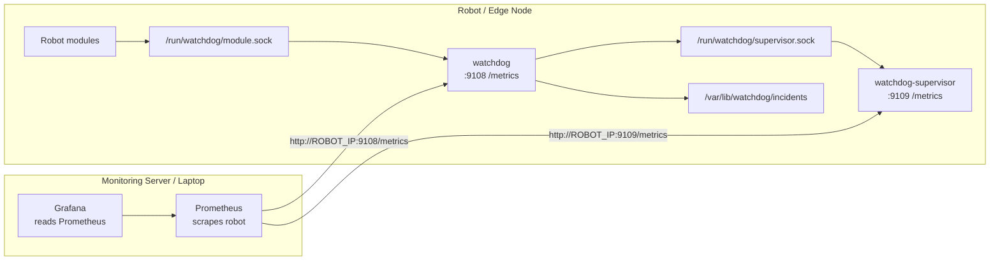
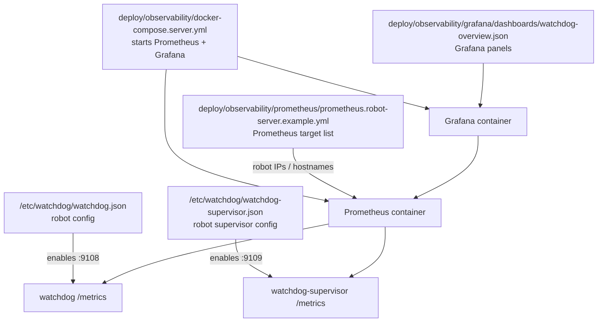
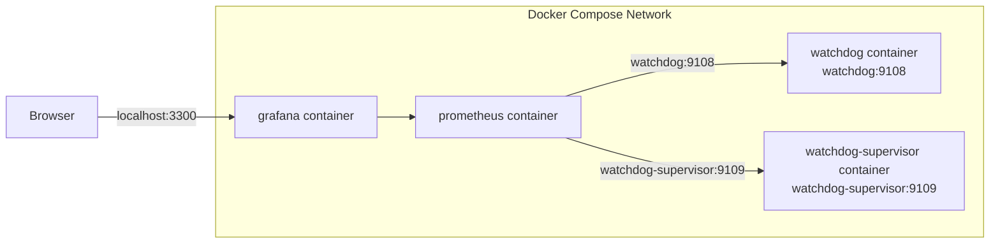
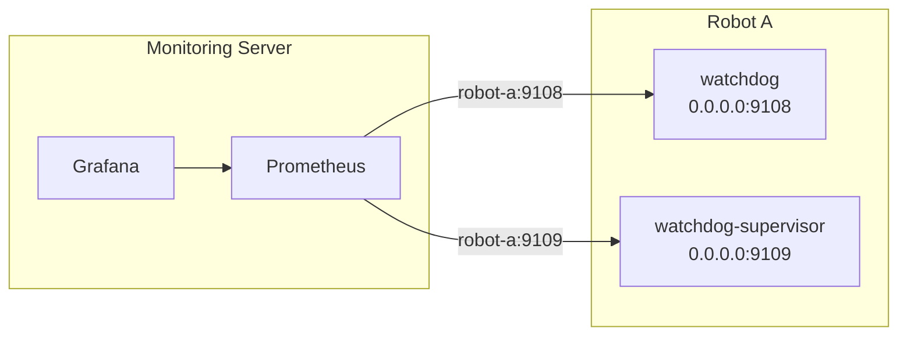
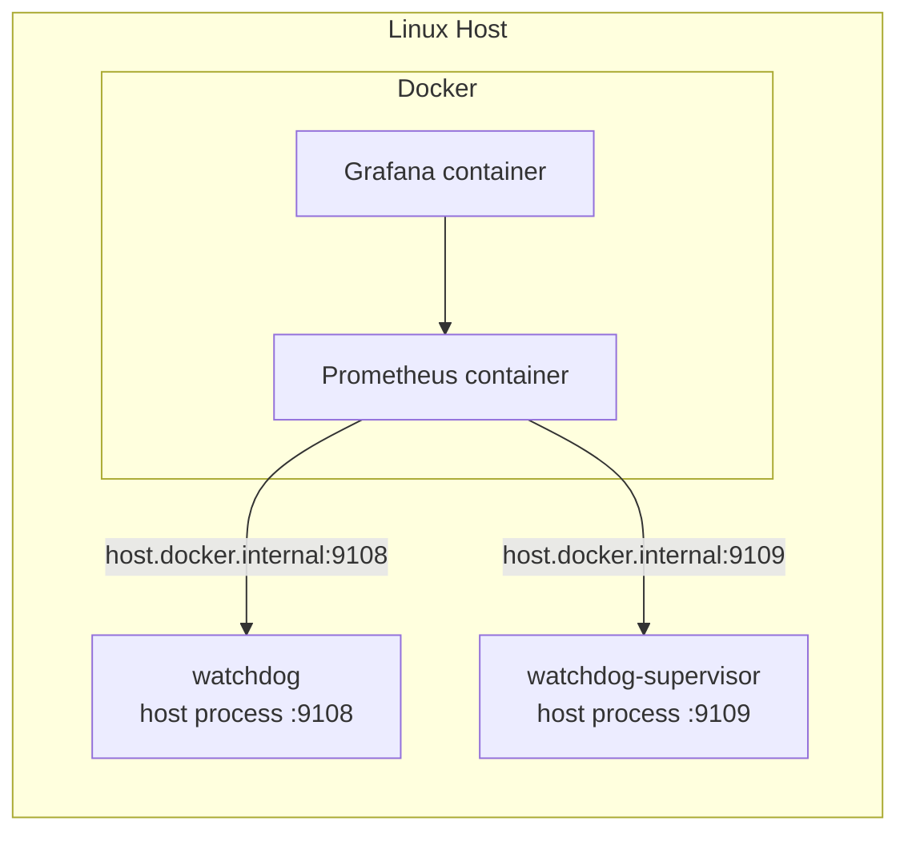

# Observability

This repository exposes Prometheus-compatible metrics from both local processes:

- `watchdog`
- `watchdog-supervisor`

The intent is:

- local watchdog and supervisor remain the control plane
- Prometheus and Grafana become the observability plane
- dashboard or network failures must not affect robot safety behavior

## Topology

There are two separate jobs:

- the robot publishes metrics
- the monitoring server collects and visualizes them



The most important point: Grafana does not talk to the robot directly. Grafana asks Prometheus, and Prometheus scrapes the robot.

## Which File Does What



Use `docker-compose.server.yml` to run the monitoring stack. Edit `prometheus.robot-server.example.yml` to tell Prometheus which robots to scrape.

## Metrics Endpoints

Example watchdog config:

```json
"metrics": {
  "enabled": true,
  "listen_address": "127.0.0.1:9108",
  "path": "/metrics"
}
```

Example supervisor config:

```json
"metrics": {
  "enabled": true,
  "listen_address": "127.0.0.1:9109",
  "path": "/metrics"
}
```

Use loopback when Prometheus runs on the same machine. If a central Prometheus server will scrape the robot directly, bind to a reachable interface and control that exposure with network policy.

## Exported Metrics

Watchdog process:

- `watchdog_snapshot_overall_code`
- `watchdog_snapshot_timestamp_seconds`
- `watchdog_snapshot_errors`
- `watchdog_snapshot_statuses`
- `watchdog_snapshot_components`
- `watchdog_component_severity_code{component_id=...}`
- `watchdog_status_severity_code{source_id=...,source_type=...}`
- `watchdog_status_observed_at_seconds{source_id=...,source_type=...}`
- `watchdog_status_metric_value{source_id=...,source_type=...,metric_name=...}`
- `watchdog_collector_last_duration_seconds{collector=...}`
- `watchdog_collector_success_total{collector=...}`
- `watchdog_collector_error_total{collector=...}`
- `watchdog_collector_healthy{collector=...}`
- `watchdog_incident_writes_total{result=written|skipped|error}`
- `watchdog_action_sink_error_total`

Supervisor process:

- `watchdog_supervisor_state_updated_at_seconds`
- `watchdog_supervisor_overall_action{action=...}`
- `watchdog_supervisor_active_components`
- `watchdog_supervisor_component_action{component_id=...,action=...,severity=...,latched=...}`
- `watchdog_supervisor_requests_total{event=...,requested_action=...,result=...}`
- `watchdog_supervisor_hook_total{action=...,result=...}`
- `watchdog_supervisor_hook_last_duration_seconds{action=...}`

Severity numeric mapping:

- `ok = 0`
- `warn = 1`
- `fail = 2`
- `stale = 3`

## Cardinality Notes

Avoid using unbounded labels.

Good:

- stable `source_id`
- stable `component_id`
- stable metric names

Bad:

- embedding reasons into labels
- embedding timestamps into labels
- generating per-message metric names from arbitrary payloads

`watchdog_status_metric_value` intentionally uses a `metric_name` label because the watchdog already accepts structured numeric metrics from modules and adapters. Keep those metric names stable and finite.

## Prometheus

Local Docker sim scrape config:

- `deploy/observability/prometheus/prometheus.docker-sim.yml`

Docker sim topology:



In this mode, targets like `watchdog:9108` work because Docker Compose provides service-name DNS inside the compose network. Those names do not work for a real robot outside that Docker network.

Central scrape example:

```yaml
scrape_configs:
  - job_name: watchdog
    static_configs:
      - targets:
          - robot-a.example.net:9108
        labels:
          robot: robot-a
          service: watchdog

  - job_name: watchdog-supervisor
    static_configs:
      - targets:
          - robot-a.example.net:9109
        labels:
          robot: robot-a
          service: watchdog-supervisor
```

The repository includes:

- `deploy/observability/prometheus/prometheus.robot-server.example.yml`
- `deploy/observability/docker-compose.server.yml`

Those are for the real deployment shape:

- watchdog runs on the robot
- Prometheus and Grafana run on a monitoring server or laptop
- Prometheus scrapes the robot over the network

Real robot topology:



In this mode, the robot configs must bind metrics to a reachable address, for example `0.0.0.0:9108` and `0.0.0.0:9109`.

Same-host Docker topology:



In this mode, `127.0.0.1` inside the Prometheus container means the container itself. Use `host.docker.internal` to reach watchdog running on the host.

## Real Robot Scrape Checklist

On the robot:

1. Use reachable metrics binds instead of loopback.
   Start from:
   - `configs/watchdog.ubuntu24-amd64.remote-metrics.example.json`
   - `configs/watchdog-supervisor.ubuntu24-amd64.remote-metrics.example.json`

2. Install them under `/etc/watchdog/`.

3. Restart:

```bash
sudo systemctl restart watchdog-supervisor watchdog
```

4. Verify locally on the robot:

```bash
curl http://127.0.0.1:9108/metrics
curl http://127.0.0.1:9109/metrics
```

From the monitoring server:

```bash
curl http://ROBOT_IP:9108/metrics
curl http://ROBOT_IP:9109/metrics
```

If Prometheus runs in Docker on the same Linux host as watchdog, target `host.docker.internal:9108` and `host.docker.internal:9109` instead. `deploy/observability/docker-compose.server.yml` already maps `host.docker.internal` to the host gateway.

If those `curl` checks fail, Grafana will show no data because Prometheus never received any samples.

## Server-Side Grafana/Prometheus

On the monitoring server:

```bash
cd deploy/observability
$EDITOR prometheus/prometheus.robot-server.example.yml
docker compose -f docker-compose.server.yml up -d
```

Then verify:

```bash
curl http://localhost:9091/api/v1/targets
```

The two robot targets must show `health: "up"`.

## No-Data Troubleshooting

If Grafana is empty:

1. Check the robot endpoints directly:
   - `curl http://ROBOT_IP:9108/metrics`
   - `curl http://ROBOT_IP:9109/metrics`

2. Check Prometheus target health:
   - `curl http://SERVER_IP:9091/api/v1/targets`

3. Check for the common misconfigurations:
   - Prometheus config still points at `watchdog:9108` and `watchdog-supervisor:9109`
   - robot configs still bind metrics to `127.0.0.1`
   - firewall blocks `9108` or `9109`
   - wrong robot hostname or IP in the Prometheus target list

## Grafana

Provisioned assets:

- datasource: `deploy/observability/grafana/provisioning/datasources/prometheus.yml`
- dashboard provider: `deploy/observability/grafana/provisioning/dashboards/dashboards.yml`
- dashboard JSON: `deploy/observability/grafana/dashboards/watchdog-overview.json`

The current dashboard is intentionally generic:

- watchdog overall severity
- supervisor held action
- active component count
- component severity time series
- freshness and time-sync metrics
- storage pressure
- collector duration
- supervisor request rate

This is the first dashboard, not the final one. Real-robot testing should drive the next panels.

For the local Docker sim profile, the published host ports are:

- Prometheus: `http://localhost:9091`
- Grafana: `http://localhost:3300`

## Datadog

The endpoints are Prometheus-compatible, so Datadog can scrape them with an OpenMetrics check if you choose Datadog instead of Prometheus plus Grafana.

The control-plane recommendation stays the same:

- local watchdog and supervisor first
- metrics export second
- remote aggregation after local behavior is trusted
